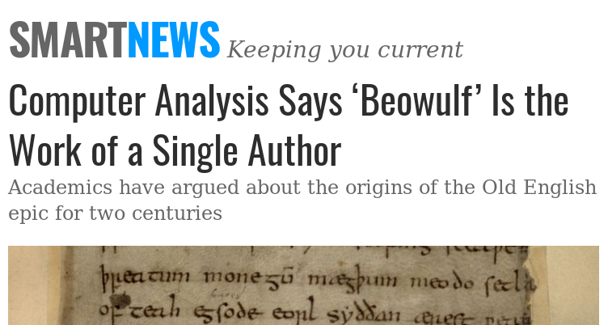

Predicting the Authorship of Poetry Snippets
========================================================
author: Nick Dieffenbacher-Krall
date: April 29, 2019
autosize: true


Project Goals
========================================================

- Determine the author of a poem using only data from that poem
- A classification problem
- Test data includes only the text of the poem

Applications
========================================================

- Determining authorship
- Classifying unknown works
- Comparing an author's canon

****



Obtaining Data
========================================================
- Poems were sourced from Project Gutenberg
- 1774 peoms from 7 19th century poets
- Parsed from books via Python script

<small>

```
                           Book          Author
1 Poems: Three Series, Complete Emily Dickinson
                                                                                                                                                                                              Poem
1 That never wrote to me, --\nThe simple news that Nature told,\nWith tender majesty.\nHer message is committed\nTo hands I cannot see;\nFor love of her, sweet countrymen,\nJudge tenderly of me!
```
</small>

***


Creating Variables
========================================================
- In order to do any classification, we need to create 
variables from the poem text
- Some easy initial variables are
    * Words per line
    * Lines per stanza
- Not yet very useful


***


Natural Language Processing
========================================================
<small>
"Much madness is divinest sense  
To a discerning eye;   
Much sense the starkest madness.   
'T is the majority    
In this, as all, prevails.   
Assent, and you are sane;   
Demur, -- you're straightway dangerous,   
And handled with a chain."   
\- Emily Dickinson
</small>
<br />
<br />
- Analysis performed by word
- Data is cleaned to make analysis easier

***
<small>
"much madness divinest sense discerning eye much sense starkest madness t majority prevails assent sane demur youre straightway dangerous handled chain"
</small>
<br />
<br /><br /><br />

- Whitespace removed
- Stop words removed
- Punctuation removed
- Experimenting with stemming words

Wordclouds
========================================================

We can visualize the differences in word use between poet
with a word cloud.

<small> Emily Dickinson  </small>


***

<small> William Blake </small>


Sentiment Analysis
========================================================
- A common way of creating data from natural langauge
- Using the AFINN sentiment lexicon


Comparision of Sentiments
========================================================


Can we make predictions?
========================================================
- We may have enough variables to make successful predictions
- Use test and train sets to evaluate models

***


Using SVM to classify author
========================================================
- Using a linear kernel, two dimensions
    * Words per line
    * Sentiment
- Cost parameter evaluated by 5 fold CV
- The model gives a successful classification rate of 0.6734234 on the test data.

***


Further work
========================================================
- More complex sentiment analysis
- Discrete variables based on word usage
- Create model using `xgboost`, and others
- Latent Dirichlet Allocation (the other LDA)
